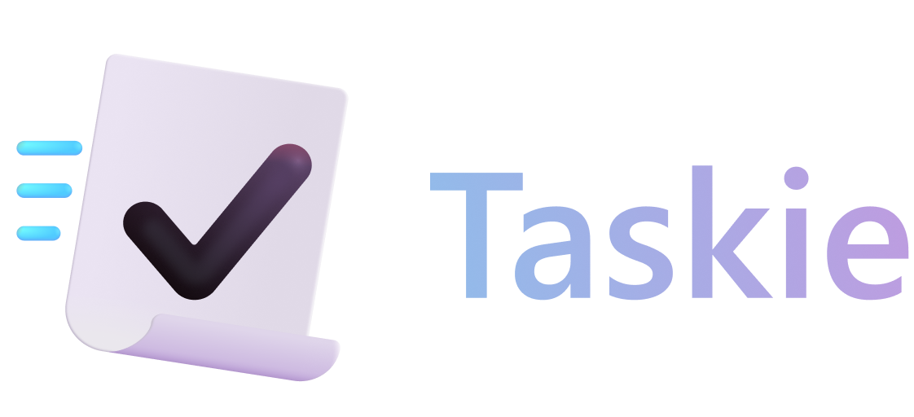

<p align=center></p>
<p align=center>Simple to-do app for Windows 10/11. Made with <b>UWP</b>.</p>

---
# THIS VERSION WILL SOON BE DEPRECATED.
This is the last open-source version of Taskie. The v1 release will be entirely closed-source. I do still accept translation requests and bug reports via Discord @shef3r or my channel on [Developer Sanctuary](https://discord.gg/windows-apps-hub-714581497222398064).

### Need a simple to-do list?
I got you. This app got a simple interface and basic file structure. Get in on the <a href="/releases">releases</a> page.

### File structure
Taskie stores your lists as JSON files in the app's local folder. You can export them into a `.taskie` file (that's just a renamed ZIP containing the JSON files) The JSON files are made with this simple syntax:

```json
[
  {
    "CreationDate": "2023-08-04T18:41:17.7177428+02:00",
    "Name": "Make dinner",
    "IsDone": true
  },
  {
    "CreationDate": "2023-08-04T18:41:25.3742071+02:00",
    "Name": "Prepare for tomorrow's test",
    "IsDone": false
  }
]
```

### Installation process
- First, download the `.msixbundle` file and the `Dependencies_xxx.zip` file (where xxx is you architecture, most common is x64)
- Then, unzip the ZIP file and install all the files by double-clicking and clicking "Install" in the window (assuming the default App Installer is installed on your machine)
- now, right click the main `.msixbundle` and click on properties, then Digital Signatures.
click on the only option, then Details, View certificate, Install certificate, check "Local machine" and click "Next".
- Once there, click the second option, then Browse and finally click "Trusted People"
- Now, click "Next" and "Finish".
- Close all the windows we opened and install the main file just like you did with the dependencies.

### Can't install the app? Found a bug? Got a feature request?
Use the "Issues" tab on top to report anything.
